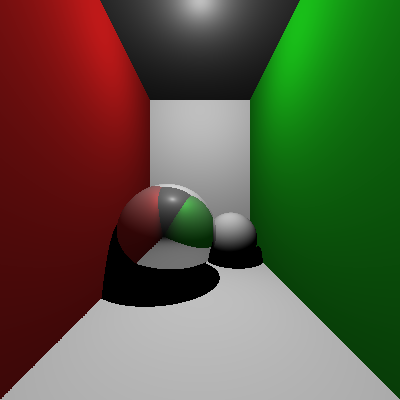
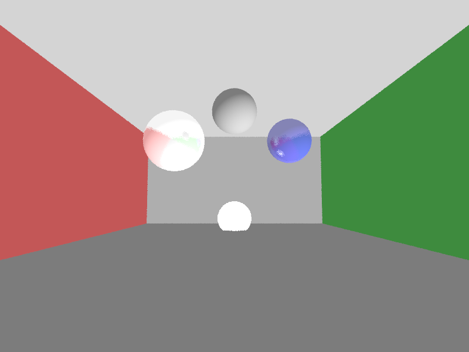
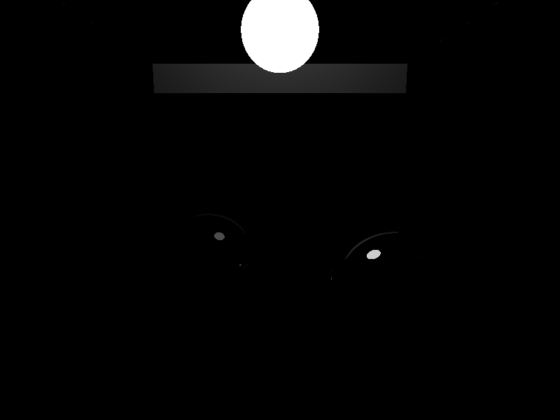

# Vorwort

Für ChatGPT wurde die neuste mögliche Version zum Zeitpunkt der Erstellung verwendet.
Bei DeepSeek die neueste Version des "Free" Plans vom 18.2.2026.
Es wird immer nur die Initialantwort und Verwendbarkeit bzw. das Ergebnis des Programms betrachtet.

Die zu beantwortende Frage war:
    Wie gut ist die Initialausgabe einer Allgemein-KI unter der Annahme, dass weder die Programmiersprache noch das konkrete Aussehen der Ausgabe eingeschränkt wird?

Hierzu wurde die Erstellung eines einfachen Raytracers gewählt, der durchschnittlich 200 Zeilen zur Erstellung benötigt. 
Er ist in den meisten weitverbreiteten Programmiersprachen implementierbar.

## Informationen

Wenn 2 Bilder in Pictures bei einer Version stehen ist die .ppm die generierte und die .png eine Kopie.
Für Versionen bei denen der Code nicht kompiliert ist in den meisten Fällen eine funktionierende Version in Edits.
In allen Fällen wurde Search und DeepThink nicht verwendet außer bei DeepSeek Version 13 DNS. 
Diese wurde später hinzugefügt um die Tauglichkeit von DeepSeek zur Codegenerierung zu Testen.
Alle Ergebnisse die im Vergleich zwischen ChatGPT und DeepSeek gezogen werden, beziehen sich nur auf die verwendeten Versionen.
Letztenendes kann kein definitives Ergebnis von einer so kleinen Promptanzahl produziert werden.
Bei den jeweiligen KI Teilen wird sich nur auf die eigenen Erkenntnisse fokussiert. 
Bei Faziten werden auch die Ergebnisse von Alex mit eingebaut.

# Allgemein zum Prompt

Der Prompt wurde händisch erstellt und bearbeitet. 
Hierbei ist es leider nicht immer zum gewünschten Ergbenis gekommen (Was zu erwarten war).
Bei der Erstellung eines Prompts wurde nicht auf das Ergebnis des vorherigen Prompts geachtet.
Der Prompt an die verschiedenen KIs soll ein kurzer, von einer Person mittleren Wissenstands geschriebene Anfrage sein.
In den verschiedenen Versionen werden (mit Absicht) mögliche Biases zu verschiedenen Programmiersprachen und möglichen Lösungswegen injiziert.
Hierbei wird nie einer Programmiersprache, eine bestimmte Klasse oder ähnliches verlangt.
Die größte Eingrenzung ist in den Versionen 10 - 13 indenen das Endergebnis in 512x512pxl gesetzt wird.

Startversion des Prompts:

    Erstelle in einer beliebigen Programmiersprache, einen einfachen Raytracer zur Darstellung einer Cornellbox.

    Dieser sollte diese Anforderungen erfüllen:

        Allgemein:
            1. Es gibt keine Speicherlecks. 
            2. Es wird minimal importiert.
            3. Es werden keine externen Seiten verwendet.
            4. Der Code ist wohlstrukturiert
            5. Der Code muss vollständig implementiert werden und ohne Addition weiteren Codes ausführbar sein

        Raytracer spezifisch:

            1. Die grafischen primitiven sind freiwählbar.
            2. Es wird ein Bild einer Variante der Cornellbox unter Verwendung des Raytracers erstellt und gespeichert.
            3. Schatten, Reflexionen, Shading und Lichtquellen müssen implementiert werden.
            4. Es sollen keine Post-Processing-Effekte angewandt werden
            5. Das Raytracing, die Mathematik und die Geografie sollten im Code unabhängig (modular) verwendbar sein

Die einzelnen Punkte des Prompts ändern sich in den meisten versionen des Prompts leicht und der Hauptunterschied wird in die gewollte Zeile integriert **nicht** hervorgehoben.

## Änderungen in den Verschiedenen Versionen des Prompts:

### Version 1:
    Standard Version, verlangt in beliebiger Programmiersprache, einen nach Lupenreinen Raytracer.
    Dieser soll Schatten, Reflexionen, Shading und Lichtquellen und keine Post-Processing-Effekte verwenden.
    Weiterhin soll die komplette Berechnung der Rays auch in der File stehen.

### Version 2:
    Leichte Umbenennung der zuerstellenden Szenerie, sowie fokus auf Unabhängigkeit der einzelnen Module

### Version 3:
    Keine Verwendung von zu erwartenden Fachbegriffen außen Cornellbox.

### Version 4:
    Fokus auf möglichst kleinen verwendeten Speicher.

### Version 5:
    Fokus auf Geschwindigkeit. Einerseits des Programms andererseits der Kompilierung.

### Version 6:
    Möglichst kurzer Code.

### Version 7:
    Versuch der Verleitung zu Java

### Version 8:
    Andere Art von Version 7

### Version 9:
    Fokus auf Verständlichkeit der Konzepte.

### Versionen 10 - 13 
    sind mit einem Extra Paragraphen versehen zu genaueren Beschreibung und Einschränkung des Codes.
    
Die einzelnen Versionen haben verschiedene Arten von:
    512x512 pxl Größe.
    Es muss eine Cornellbox geben.
    Es muss mindestens 1 Licht und 1 Objekt geben.
    Das Bild wird mit einem festen Namen gespeichert.

# ChatGPT: 

##  Allgemeines:

ChatGPTs Codeerstellung ist sehr an das Min-Max Pronzip angelehnt.
Es wird versucht, mit der niedrigst möglichen Anzahl an Zeilen den möglichst größten Teil des Prompts zu erfüllen.
Das Erwähnen von Fokuspunkten und bestimmten Fachbegriffen führt meistens dazu, dass der fokussierte Teil des Codes auch wirklich funktioniert.
Hierbei besteht allerdings das Problem das durch Fokusierungen, häufig ein anderer Teil des Codes vernachlässig wird.
Der nicht-fokussierte Codeteil wird zwar meistens noch geschrieben, es kann aber sein, dass dieser nicht oder nur teilweise korrekt integriert wird.
Weiterhin setzt ChatGPT auf Codeklarheit, aber nicht im Zeilen/Methoden Verständnis, sondern im allgemein Verständnis. 
Es setzt über Klassen große Kommentarblöcke, die nur den Klassennamen wiederholen. 
Wenn einzelne Funktionen speziell gefordert werden (Wie in meinem Prompt "Schatten, Reflexionen, Shading und Lichtquellen") werden diese im Code markiert.
Nachfragen über Codeteile funktionieren nur als "Erkläre mir wie" Fragen und nicht als "Diese Methode macht X, oder?", da ChatGPT ein "Ja-Mann" ist.
Weiterhin hat man bei meinem Codebeispiel als auch bei Alex gesehen, dass ChatGPT keinen großen Gesamtplan für den Code setzt, sondern diesen aus Einzelteilen zusammensetzt.
Hierbei wird nicht (oder nicht ausreichend) überprüft ob einzelne Teile untereinander sich Zanken.
Dies wird ersichtlich hauptsächlich an drei Punkten unserer Beispiele.
Zuerst bei mir das Hauptproblem ChatGPTs mit den Shadowrays, welche in allen bis auf zwei Versionen genau gleich implementiert wurden.
Die zwei nicht gleichen Implementierungen sind einmal das komplette Ignorieren des Promptteils (Durch den vorher genannten Fokus auf andere Teile des Codes) und die einzige "perfekte" ("funktionierende") Lösung.
Der zweite Punkt, auch in meinem Teil, ist das sofortige Erkennen des Fehlers bei Gabe des Codes (Ersichtlich in /"AI Tries Fixing").
Hier zeigt sich, dass selbst wenn, der Prompt nur aus Problembeschreibung und Code besteht, dass ChatGPT den Fehler findet und lösenden Code zur Verfügung stellt.
Dies deutet darauf hin, dass ChatGPT Code dieser Länge versteht und auch untersuchen kann, aber nicht beim erstellen erneut überprüft.
Somit sollte das erneute senden des Codes in einen neuem Chat zu einem besseren Grundergebnis führen.
Zusätzlich zeigt sich, dass ChatGPT häufig stark auf die exakte Formulierung des Prompts reagiert.
Kleine sprachliche Änderungen können dabei bereits zu deutlich anderen Codeergebnissen führen.
Dabei wird ersichtlich, dass Prioritäten implizit aus der Wortwahl abgeleitet werden.
Explizite Gewichtungen im Prompt beeinflussen daher die Struktur des generierten Codes erheblich.
Ohne klare Priorisierung behandelt ChatGPT viele Anforderungen als gleichrangig.
Dies kann dazu führen, dass komplexe Kernlogik und nebensächliche Details denselben Raum erhalten.
Ein weiterer Punkt ist die Tendenz zur Wiederverwendung ähnlicher Lösungsstrukturen.
Oft orientiert sich der generierte Code an zuvor erfolgreichen Mustern.
Dadurch entstehen konsistente, aber nicht immer optimal angepasste Implementierungen.
Besonders bei grafischen oder mathematischen Problemen zeigt sich diese Musterorientierung deutlich.
ChatGPT optimiert zudem selten iterativ innerhalb einer einzigen Antwort.
Stattdessen wird eine scheinbar abgeschlossene Lösung präsentiert.
Interne Abhängigkeiten zwischen Methoden werden nicht systematisch validiert.
Fehlende Rückkopplungsschleifen im Generierungsprozess verstärken dieses Problem.
Auch Randfälle werden nur berücksichtigt, wenn sie explizit genannt werden.
Nicht spezifizierte Edge-Cases bleiben daher häufig unbeachtet.
Die Struktur des Codes wirkt oft logisch, aber nicht vollständig durchdacht.
Dies lässt vermuten, dass lokale Kohärenz über globale Konsistenz priorisiert wird.
Komplexitätsmanagement erfolgt eher oberflächlich als architektonisch geplant.
Insgesamt entsteht Code, der funktional wirkt, jedoch nicht immer als ganzheitliches System entworfen wurde.

## ChatGPTs Codephilosophy (Von ChatGPT selbst zum Vergleich):

Minimierung der Zeilen: Wo immer möglich, versuche ich, redundante oder unnötige Codezeilen zu vermeiden. Das bedeutet, dass ich nicht unnötig ausführliche Strukturen oder Kommentare hinzufüge, wenn sie nicht unbedingt notwendig sind. Das Ziel ist, Code zu erzeugen, der funktional ist, aber auch so kurz wie möglich bleibt.

Fokus auf Klarheit: Manchmal erfordert der „maximale Teil“ eines Prompts mehr Kontext oder bestimmte Best Practices, die einen Code etwas ausdehnen, aber das ist okay, solange die Lesbarkeit nicht leidet. Ich vermeide es, Lösungen zu entwickeln, die zwar minimal sind, aber schwer zu verstehen oder zu warten wären.

Flexibilität bei der Erfüllung des Prompts: Nicht immer bedeutet „minimale Zeilen“ auch die beste Lösung. Es gibt Fälle, in denen es besser ist, einige Zeilen mehr zu verwenden, um eine robustere, sicherere oder wartungsfreundlichere Lösung zu bieten. Der „maximale“ Teil des Prompts bezieht sich daher oft auch auf die Qualität und die Flexibilität der Lösung.

Vermeidung von Overengineering: Oft ist es verlockend, zusätzliche Funktionen oder abstrakte Lösungen einzuführen, die „perfekt“ wären, aber nicht notwendig für das eigentliche Ziel des Prompts. Ich versuche, solche Lösungen zu vermeiden, um die Einfachheit zu wahren.

Adaptivität: Wenn ein Problem mit einer minimalen Lösung nicht gut gelöst werden kann (z.B. wegen Performance oder Zukunftssicherheit), werde ich bereit sein, die Lösung zu erweitern, aber immer mit dem Ziel, so wenig wie möglich zu tun, um das gewünschte Ergebnis zu erzielen.

## Ergebnisse bei Promptversionen

### Des Perfekte

Das einzige Perfekte in den 13 Versionen bei ChatGPT (Das nicht repariert werden musste für)

### Standardausgabe

Die Standardausgabe bei ChatGPT, der komplett Schwarze. Dies liegt an dem zuvor besprochenen Hauptfehler und ist für die Versionen 2, 3, 5, 6, 8, 9, 10, 13 zu sehen.

### Ignorieren des Prompts

In Version 1 des Prompts hat ChatGPT den Schattenteil des Prompts einfach ignoriert.

### Ambient Light

In den Versionen 7 und 12 hat ChatGPT Ambient Light implementiert und damit das komplett schwarze bild vermieden (Sonst wäre es die Standardausgabe).

## Technische Daten

ChatGPT hat sich 6/13 (46.2%) der Zeit für C++ und 7/13 (53.8%) für Python entschieden. Versuche auf Java zu lenken (ohne Zwang) liefen leer aus.
Bei 1/13 (7.7%) Versionen ist zur Initialerstellung ein "perfektes" oder gewolltes Ergebnis erstellt worden. 
Dieses gelang bei Version 4 in C++ (siehe Endergebnis "/Pictures/V4Box.ppm").
Das Am meisten Verbreiteteste Problem bereitete der Promptteil der Schattenerstellung. 
8/13 (61.5%) der Versionen (V: 2, 3, 5, 6, 8, 9, 10, 13) haben den gleichen Fehler. 
2/13 (15.4%) haben das Problem auch, haben aber Ambient Light (unaufgefordert) im Code hinzugefügt und damit das komplett schwarze Output File vermieden.
Somit haben 10/13 (76.9%) das selbe Problem. Dieses ist, dass bei der Schattenberechnung Wände ("Plane"s in den meisten Versionen) als Intersectobjekte gezählt werden. Dies führt dazu, dass die Wand hinter, sowie jede andere, als Schattenkriterium gewertet werden. Damit wird der komplette Output Schwarz (außer Ambient Light erhellt nachträglich).
In Version 11 (1/13 7.7%) ist das Compilieren fehlgeschlagen, da eine define Zeile für M_PI vergessen wurde. Nach Lösen dieses Problems ist es eines der besten Ergebnisse (zu finden in Einfach/Edits/GPT/Dark/V11/cornellbox.ppm).
2/13 (15.4%) haben als Output Filetype .png gewählt. Der Rest 11/13 (84.6%) haben .ppm gewählt. Dies liegt wahrscheinlich daran, dass im Prompt dieser (V10-V13) ein "(z.B. Cornellbox)" benutzt wurde.

Bei der Fehlerbehebung mit ChatGPT des eigenen Fehlers im Code von Version 2, konnte ChatGPT den Hauptfehler (Schatten-Ray) immer erkennen.
Hierbei war es egal wie genau die Fehlerquelle eingegrenzt wurde. Alleine das Endergebnis des Fehlers (Schwarze Output File) hat gereicht um ChatGPT auf die korrekte Fehlerbehebung zu bringen. Sobald auch nur die konkrete Klasse des Fehlers genannt wurde hat ChatGPT auch den Fehler gefunden, der speziell bei der 2. Version zum Kompilierabbruch führt (Die Negation eines Vec3 ist undefiniert). Weitere Präzision führt zu keiner Verbesserung des Codes oder der Antwort.

Mögliche Lösung des Standardproblems

    shadow_hit = scene.trace(shadow_ray)
        if shadow_hit:
            dist_to_light = (light.pos - point).length()
            if shadow_hit[0] < dist_to_light:
                continue

## Länge von ChatGPT Code (Zeilen)

    | Version | Lines |
    |---------|-------|
    |   V1    |  199  |
    |   V2    |  261  |
    |   V3    |  272  |
    |   V4    |  239  |
    |   V5    |  163  |
    |   V6    |  127  |
    |   V7    |  209  |
    |   V8    |  196  |
    |   V9    |  213  |
    |   V10   |  215  |
    |   V11   |  267  |
    |   V12   |  226  |
    |   V13   |  213  |
    | Total   | 2800  |
    | Average | 215.4 |

## Fazit

### Best Practice Advice:

Fokuspunkte sollten im Prompt klar und eindeutig markiert werden, damit zentrale Anforderungen priorisiert umgesetzt werden.
Zudem ist es sinnvoll, gezielt nach Modularität und Erweiterbarkeit zu fragen, um eine nachhaltige Code-Struktur zu fördern.
Der generierte Code sollte unmittelbar ausführbar sein, ohne dass grundlegende Anpassungen notwendig sind.
Treten Fehler auf, empfiehlt es sich, den vollständigen Code in einem neuen Chat zur Korrektur einzureichen, um ein verbessertes Grundergebnis zu erhalten.

### Erkenntnisse:

ChatGPT folgt bei der Codegenerierung häufig einem Min-Max-Prinzip, bei dem mit möglichst wenig Struktur möglichst viele Anforderungen abgedeckt werden sollen.
Viele Fehler entstehen durch die fragmentierte, „Frankenstein“-artige Zusammensetzung einzelner Codebausteine ohne durchgehenden Gesamtplan.
Wird derselbe Code jedoch in einem neuen Chat zur Analyse vorgelegt, kann ChatGPT ihn meist zuverlässig verstehen, Fehler identifizieren und gezielt reparieren.

# DeepSeek:

## Allgemein:

DeepSeek Codegenerierung ist oberflächig und ausgiebig.
Bei der Generierung werden häufig fehlerhaft Operanten verwendet.
Diese sind dann meist undefiniert für die bestimmte Typ-Kombination oder falsch implementiert im Allgemeinen.
Das Reparieren des gelieferten Codes dauert häufig an, da das Programm (natürlich) abbricht sobald es einen Fehler findet (z.b. operant+ undefined for int - Vec3).
Dies führt dazu das weitere Fehler der gleichen Art nicht angezeigt werden.
Da das ausführen von DeepSeek Code lange dauert, wird die Reparaturzeit somit stark verlängert (nicht DeepSeeks Problem zu 100%).
DeepSeek optimiert, bzw. setzt Standardwerte häufig auch außerhalb der Norm (z.b. V11 mit max_depth = 20).
Code generiert von DeepSeek ist meist stark Bloated. 
Dabei handelt er sich nicht um Erweiterungsmöglichkeiten oder ähnliches.
Die Lesbarkeit wird durch Kommentare vor den meisten Zeilen stark erhöht.
Dabei sind in den einzelnen Zeilen praktisch nie die Probleme, sondern nur in der Kombination mehrerer Zeilen die sich zanken.Zeilen.
Zusätzlich fällt auf, dass DeepSeek häufig sehr viele Hilfsvariablen einführt.
Diese Variablen tragen nicht immer zur tatsächlichen Problemlösung bei.
Oft werden Berechnungen unnötig aufgesplittet, obwohl eine kompaktere Lösung möglich wäre.
Dadurch entsteht ein erhöhter Wartungsaufwand im weiteren Entwicklungsprozess.
Strukturell wirken viele Implementierungen übermäßig verschachtelt.
Kontrollstrukturen werden teilweise redundant eingesetzt.
Fehlende Typprüfungen führen regelmäßig zu vermeidbaren Laufzeitfehlern.
Generische Funktionen werden selten wirklich generisch umgesetzt.
Stattdessen entstehen stark spezialisierte Einzelimplementierungen.
Optimierungen wirken häufig kosmetisch statt algorithmisch fundiert.
Speicher- oder Laufzeitkomplexität wird nur selten bewusst berücksichtigt.
Zudem werden bestehende Abhängigkeiten zwischen Komponenten nicht konsequent analysiert.
Das Zusammenspiel einzelner Module bleibt daher anfällig für Seiteneffekte.
Testfälle oder Validierungsmechanismen werden kaum mitgedacht.
Insgesamt entsteht der Eindruck einer ausführlichen, aber nicht tiefgreifend abgestimmten Codebasis.

## Ergebnisse bei Promptversionen

Da bei DeepSeek die meisten Versionen nicht Initial funktioniert haben, sind alle Versionen gezeigt.

### Schattenlos

Wie ChatGPT ignoriert DeepSeek bei Version 1 den Prompt zur Implementierung von Schatten

### Ambient Light Grey

### Weiß mit Rauschen

### Funktionsfähig aber Schwarz

### Schwarz

ChatGPT-Fehler auch hier bei DeepSeek zu sehen.

### Unendlichkeit

Falscher Bau der Cornellbox

### Wer denken kann ist im Vorteil

Ein perfektes Modell nach 120 Sekunden warten.

## Technische Daten

DeepSeek Antworten sind sind meistens (codeweise) deutlich länger als ChatGPT Antworten (ca. 374 Zeilen).
Der Code ist dafür meistens nicht beim initialen erstellen benutzbar in 7/13 (53.8%) ist kein compilieren möglich.
Weiterhin ist in keinem der 6/13 übrigen Testprompts ein verwendbarer Code initial herausgekommen.
Im Sonderfall V13DNS (Prompt V13 und Aktiviertes "Search" und "Deep Think") kam nach ~2 minütigem (118 Sekunden) Denken ein brauchbares Ergebnis geliefert. 
Jedoch wurde hier, sowie in 2/13 (Total: 3/14 21.4%) der Versionen externen extra zu installierende nicht-standard Imports (Dazu zählt: numpy und PIL) verwendet.
Weiterhin hat Deepseek trotz des Versuchs mit Promptänderungen die Sprachwahl zu beeinflussen, zu 11/13 (84.6%) der Zeit für Python und 2/13 (15.4%) für C++ entschieden.

## Länge von DeepSeek Code (Zeilen)

    | Version | Lines |
    |---------|-------|
    |   V1    |  373  |
    |   V2    |  425  |
    |   V3    |  375  |
    |   V4    |  321  |
    |   V5    |  432  |
    |   V6    |  282  |
    |   V7    |  353  |
    |   V8    |  475  |
    |   V9    |  337  |
    |   V10   |  379  |
    |   V11   |  408  |
    |   V12   |  382  |
    |   V13   |  325  |
    | Total   | 4867  |
    | Average | 374.4 |

## Fazit

### Best Practice Advice:

Prompts sollten bei DeepSeek möglichst eindeutig, technisch präzise und stark eingegrenzt formuliert werden.
Typdefinitionen und erlaubte Operatoren sollten explizit gefordert werden, um Kompilierfehler zu vermeiden.
Externe Bibliotheken sollten im Prompt ausdrücklich verboten oder erlaubt werden.
Eine schrittweise Validierung einzelner Module wäre sinnvoller als eine vollständige Generierung auf einmal.

### Haupterkenntnisse:

DeepSeek produziert umfangreichen, stark kommentierten, aber häufig nicht direkt kompilierbaren Code.
Viele Fehler entstehen durch inkonsistente Operatorüberladungen und Typkombinationen.
Die Lösungen wirken ausführlich, jedoch architektonisch nicht vollständig abgestimmt.
Mit aktiviertem „DeepThink“ steigt die Qualität deutlich, jedoch auf Kosten der Generierungszeit.
Ohne zusätzliche Denkzeit ist die Initialausgabe meist nicht unmittelbar verwendbar.

# Gesamtfazit

## DeepSeek vs ChatGPT

ChatGPT erzeugt kompakteren und strukturell klareren Code als DeepSeek.
DeepSeek generiert deutlich längeren, aber häufiger fehleranfälligen Code.
ChatGPT scheitert primär an konzeptionellen Integrationsfehlern (z. B. Shadow Rays), während DeepSeek häufiger an syntaktischen und typbezogenen Problemen scheitert.
ChatGPT liefert schneller nutzbare Ergebnisse, DeepSeek benötigt häufig Nacharbeit oder zusätzliche Denkzeit.
Für diese Länge des Programms (ca. 200-300 Zeilen) sollte ChatGPT verwendet werden. 
Ob DeepSeek andere Programmiersprachen oder Programmlängen besser kann, ist unbekannt.

## Kleine Projekte vs Große Projekte

Bei kleineren, klar definierten Projekten liefert ChatGPT meist schneller ein lauffähiges Grundgerüst.
DeepSeek produziert umfangreichere Strukturen, die sich theoretisch besser erweitern lassen, jedoch initial instabil sind.
Mit steigender Projektgröße steigt die Wahrscheinlichkeit struktureller Inkonsistenzen bei beiden Modellen.
Ohne iterative Validierung nimmt die Fehleranfälligkeit mit wachsender Komplexität deutlich zu.

## Freiheit vs Einschränkung (bei Programmiersprache)

Freie Sprachwahl führt bei beiden Modellen zu impliziten Präferenzen (Python bei DeepSeek, Python/C++ bei ChatGPT).
Leichte sprachliche Lenkung im Prompt reicht nicht aus, um die Sprachwahl zuverlässig zu steuern.
Mehr Freiheit führt zu kreativeren, aber weniger kontrollierbaren Resultaten.
