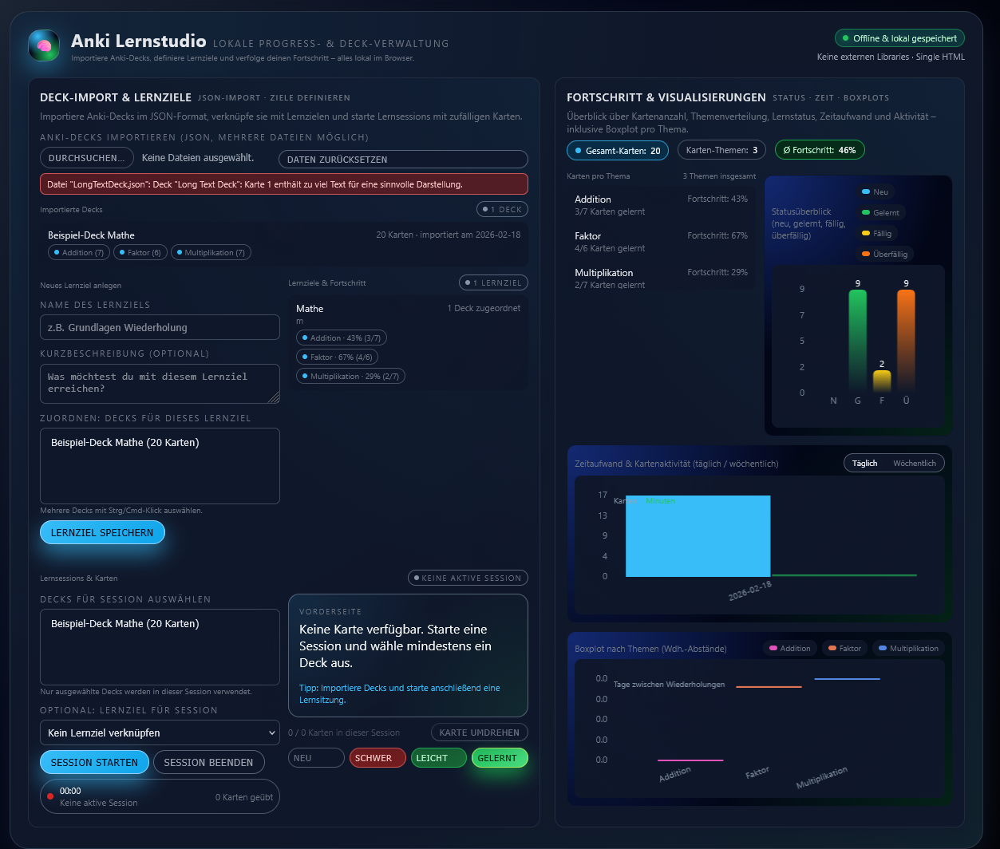
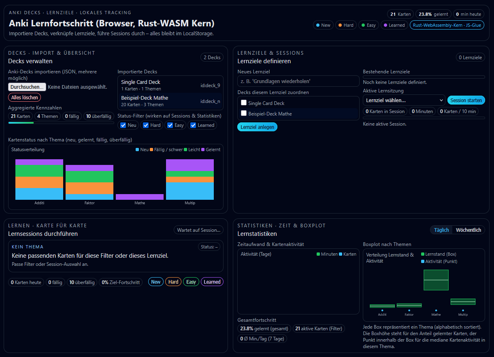

# Fragestellung und Vorgehen:  

Kann eine LLM die Arbeit eines Junior-Developers ersetzen und eine klar vorgegebene  
Programmieraufgabe in zwei verschieden komplexen Sprachen vollständig realisieren?   
Welche Probleme treten dabei auf und für welche Teile benötigt sie externe Hilfe?  
Gibt es Dinge, die gar nicht funktionieren?  

Mit diesen Fragen habe ich mich im Zuge dieser Projektarbeit beschäftigt und verwende dabei  
stellvertretend für kostenlose LLMs [ChatGPT 5.2](https://developers.openai.com/api/docs/models) und stellvertretend für Business Lösungen  
[Cursor AI Agents](https://cursor.com/docs/models) auf Basis von Claude 4.6, Gemini 3.0, GPT-5.2 / GPT-5.3 Codex und Grok Code,  
wobei Cursor intern je nach Aufgabe entscheidet, welches Model am besten dafür geeignet ist.  
Die Verwendung dieser Modelle fand im Februar 2026 statt.  

Preislich bewegt sich ChatGPT von einer kostenlosen Version bis hin zu einer 229€ pro Monat Version für Verbraucher  
und für Businesses in etwa 25€ pro Nutzer pro Monat. Für Agenten mit GPT-Codex werden  
in etwa 1,50€ / 6 € pro Millionen Tokens berechnet bei Eingabe / Ausgabe.  
Cursor dagegen hat auch eine kostenlose Version, aber zur vollen Nutzung als Verbraucher ist ein monatlicher Plan  
mit Preisen von 20$ bis 200$ benötigt. Für Unternehmen liegen die Kosten in etwa bei 40$ pro Nutzer pro Monat.  
Bei der Verwendung von APIs bezieht Cursor die Preise direkt von den jeweiligen Anbietern der Modelle, [hier einsehbar](https://cursor.com/docs/models).  

Grundlegend sollen in diesem Versuch beide Anbieter mit denselben Anforderungen eine .html erstellen,  
die lokal im Browser eine ausführbare App implementiert. Die App selbst soll mittels eines festgelegten  
Import-Formats Anki-Karten darstellen und dem Nutzer ermöglichen, seinen Fortschritt beim Lernen dieser  
zu tracken und grafisch dargestellt zu bekommen.  
Dabei wird in zwei unterschiedlichen Versuchen die Programmiersprache festgelegt.  
Bei der leichten Version wird diese auf HTML, CSS und Javascript gesetzt und  
bei der schweren Version auf HTML, CSS und Javascript im Frontend mit WebAssembly in Rust geschrieben im Backend.  
Damit soll ein Vergleich geschaffen werden zwischen weitverbreiteten Sprachen mit vielen Informationen  
und eher unbekannteren Sprachen mit weniger Bezugsquellen dazu.  
Außerdem werde ich durch gezielte Iterationen versuchen, die LLMs zum Reparieren ihrer Fehler zu bewegen.  

### Prompt für Version 1:

    Erstelle eine lokale Web-App zur Verwendung von Ankikarten und Verwaltung von Lernfortschritt in Verbindung mit Anki-Decks:
    Funktionale Anforderungen: 
    1. Nutzer kann ein oder mehrere Anki-Decks importieren (JSON-Format, wie unten dargestellt) 
       und danach die enthaltenen Anki-Karten erlernen, indem er die Vorderseite gezeigt bekommt, 
       danach zur Lösung umdrehen kann und dann kategorisiert, 
       wie schwer er diese Karte fand in 4 Kategorien: new, hard, easy, learned. 
      Dabei werden die Karten in zufälliger Reihenfolge gezeigt. 
    2. Nutzer kann Lernziele anlegen und beliebig viele importierte Decks einem Lernziel zuordnen. 
    3. Nach Import werden folgende Daten angezeigt: 
      - Anzahl Karten 
      - Karten pro Thema 
      - Kartenstatus (neu, gelernt, fällig, überfällig) als Graph mit Legende 
    4. Nutzer kann Lernsessions starten und stoppen und diese Decks zuordnen. 
    5. Der Lernfortschritt wird berechnet als: 
      - Prozent gelernter Karten pro Thema 
      - Gesamtfortschritt über alle Themen 
    6. Zeitaufwand und Kartenaktivität werden getracked und übersichtlich 
       im UI dargestellt (täglich / wöchentlich) mit Beschriftung. 
    7. Darstellung als Boxplot mit Beschriftung, sortiert nach Themen 
       und farblich unterteilt mit Legende. 
       
    Technische Anforderungen: 
      - Eine einzelne HTML-Datei mit eingebettetem JavaScript und CSS. 
      - Keine externen Libraries. 
      - Saubere Trennung von: 
         - Datenmodell 
         - Logik 
         - UI 
      - Lokale Persistenz via LocalStorage. 
      - Robuste Fehlerbehandlung bei Importen.
      
    Anki-Deck-JSON-Format: 
    { 
     "deckName": "Beispiel-Deck", 
     "cards": [ 
      { 
       "id": "1", 
       "front": "Frage", 
       "back": "Antwort", 
       "topic": "Grundlagen", 
       "status": "learned", 
       "lastReviewed": "2024-01-10" 
      } 
     ] 
    } 
   
    Antworte ausschließlich mit dem vollständigen Code. Stelle keine Rückfragen.
    Begrenze dabei deine Antwort auf 2000 Zeilen Code maximal.

## Prompt für Version 2:

    Erstelle eine lokale Web-App zur Verwendung von Ankikarten und Verwaltung von Lernfortschritten in Verbindung mit Anki-Decks: 
    Funktionale Anforderungen: 
    1. Nutzer kann ein oder mehrere Anki-Decks importieren (JSON-Format, wie unten dargestellt) 
       und danach die enthaltenen Anki-Karten erlernen, indem er die Vorderseite gezeigt bekommt, 
       danach zur Lösung umdrehen kann und dann kategorisiert, 
       wie schwer er diese Karte fand in 4 Kategorien: new, hard, easy, learned. 
       Dabei werden die Karten in zufälliger Reihenfolge gezeigt. 
    2. Nutzer kann Lernziele anlegen und beliebig viele importierte Decks einem Lernziel zuordnen. 
    3. Nach Import werden folgende Daten angezeigt:
     - Anzahl Karten 
     - Karten pro Thema 
     - Kartenstatus (neu, gelernt, fällig, überfällig) als Graph mit Legende 
    4. Nutzer kann Lernsessions starten und stoppen und diese Decks zuordnen. 
    5. Der Lernfortschritt wird berechnet als: 
     - Prozent gelernter Karten pro Thema 
     - Gesamtfortschritt über alle Themen 
    6. Zeitaufwand und Kartenaktivität werden getracked und übersichtlich im UI dargestellt (täglich / wöchentlich) mit Beschriftung. 
    7. Darstellung als Boxplot mit Beschriftung, sortiert nach Themen und farblich unterteilt mit Legende. 
    
    Technische Anforderungen: 
    - Die App nutzt eine einzelne HTML-Datei, die CSS, das Frontend-Javascript sowie ein eingebettetes WebAssembly-Modul enthält. 
    - Wasm-Core: Die rechenintensiven Aufgaben (Fortschrittsberechnung, Sortierung der Boxplot-Daten, Status-Filterung...) müssen 
      im WebAssembly-Modul, geschrieben in Rust , implementiert sein. 
    - JavaScript-Glue: JavaScript dient ausschließlich als Brücke für die DOM-Manipulation, 
      das Event-Handling und den Datentransfer zwischen LocalStorage und dem Wasm-Speicher. 
    - Saubere Trennung von: 
       - Datenmodell 
       - Logik 
       - UI 
    - Lokale Persistenz: Speicherung des Status in LocalStorage und beim Laden wird der State zur Verarbeitung an das Wasm-Modul übergeben. 
    - Robuste Fehlerbehandlung bei Importen. 
    Anki-Deck-JSON-Format: 
    { 
    "deckName": "Beispiel-Deck",
    "cards": [
      { "id": "1",
        "front": "Frage",
        "back": "Antwort",
        "topic": "Grundlagen",
        "status": "learned",
        "lastReviewed": "2024-01-10" 
      } 
     ] 
    } 
    Antworte ausschließlich mit dem vollständigen Code. Stelle keine Rückfragen.
    Begrenze dabei deine Antwort auf 2000 Zeilen Code maximal.

# Ergebnisse:

### Im Überblick  
| Versuch | Anzahl Iterationen | Zeilen Code | Ergebnis |
|:-------:|:------------------:|:-----------:|:---------:|
| ChatGPT leicht | 6 | 442 | ✔ OK |
| ChatGPT schwer | 4 | 261 | ✘ Abbruch |
| Cursor leicht | 3 | 1128 | ✔ OK |
| Cursor schwer | 3 | 1029 | ✔ OK |

### Quality Assurance und Absicherung der Imports  
*EC = Edge-Case-Tests, max. 6*  
*Bestehend aus: DoubleID / InvalidDate(Abgelaufen) / LongText / Minimal(0 Karten) / MissingParts / WrongTime(Zukunft)*  
| Versuch | Erfüllte EC zu Beginn | Erfüllte EC nach "Selbstreflexion" | Erfüllte EC nach spezifischer Hilfestellung |
|:-------:|:------------------:|:-----------:|:---------:|
| ChatGPT leicht | 1 | 3 | 6 |
| ChatGPT schwer | 0 | - | - |
| Cursor leicht | 1 | 3 | 6 |
| Cursor schwer | 0 | 3 | 6 |

**Zu Beginn** bezieht sich auf die erste Ausgabe nach dem initialen Prompt.  
**"Selbstreflexion"** wurde durch einen weiteren Prompt mit Ermahnung an allgemeine Importkontrollen ausgelöst.  
**Spezifische Hilfestellung** bedeutet, dass ich explizit die noch möglichen Fehlerquellen im Prompt benannt habe.  

## ChatGPT leicht:  

Allgemein wurden alle Tests mit ChatGPT in der Browserversion durchgeführt und waren nach maximal 2 Minuten fertig realisiert.  

Anfangs gibt es keine ordentlichen Importkontrollen und Fehler in der Boxplot-Darstellung.  
Außerdem ist die Implementierung für "Lernziele" nur oberflächlich und nicht eingebunden in den Rest.  
Auch kritische Fehler in der Umsetzung von Lernsessions sind vorhanden,   
wodurch mehrere gleichzeitig startbar waren und damit das Programm zerlegt haben.  
Über mehrere Iterationsschritte konnten alle Fehler dann Schritt für Schritt ausgebessert werden.   

## ChatGPT schwer:  

Die erste Version wirft bei Verwendung direkt Fehler und hat gar kein funktionierendes Backend.
Auch nach mehreren Versionen können zwar Imports oberflächlich stattfinden und Fehlermeldungen beseitigt werden, 
aber die Daten gehen direkt wieder verloren und Lernsessions können nicht gestartet werden.
Ein Boxplot ist auch nicht vorhanden. Beim aufwändigen Denkprozess zum Rust-Teil wurde zeitgleich ein Großteil 
der eigentlichen Anforderungen des Programms wieder verworfen und auch mit zusätzlichen Prompts
dreht sich die Entwicklung im Kreis. 
Deshalb habe ich den Versuch abgebrochen.

## Cursor leicht:  

Allgemein wurden alle Tests mit Cursor in der Desktopapp durchgeführt, mithilfe eines Cursor Agent Chats.
Dabei wurde in der Durchführung zwischen 8 und 18 Gigabyte RAM belegt, je nach Prompt und Größe des Kontexts.
Zur Realisierung der Ergebnisse brauchte Cursor zwischen 5 und 10 Minuten pro Prompt.

Anfangs gibt es keine ordentlichen Importkontrollen, aber sehr viele Details zur besseren Verwendung aus Usersicht.  
Die Kontrollen lassen sich leicht ergänzen und auch kleinere Alignment-Fehler sind schnell behoben.  
Nur Unschönheiten in Boxplots sind nicht ganz optimal lösbar.  

## Cursor schwer:  

Anfangs gibt es gar keine Importkontrollen!  
Im Thinking-Prozess wurde außerdem der Sinn hinter der Rust-Implementierung hinterfragt.  
Die Umsetzung íst aber solide, allerdings fehlen jetzt einige der optionalen Zusätze, die in der ersten Version noch vorhanden waren.  
Die Kontrollen lassen sich leicht ergänzen und Boxplots sind diesmal deutlich durchdachter.  

# Interpretation:  

Bereits während der Ausführung der Tests und auch jetzt mit den fertigen Ergebnissen im Vergleich  
wird für mich deutlich, dass ChatGPT deutlich kürzere und vereinfachte Lösungen bevorzugt.  
Dabei scheinen die Anforderungen im Prompt das Maximum zu sein, das ChatGPT erreichen kann,  
aber oftmals nicht erreicht und im Denkprozess dann Teile davon wieder vergisst.  
Meine Vermutung hierbei ist, dass ChatGPT bei so großen Aufgaben die Grenzen seines Kontext Cache bereits erreicht.  
Beim Verwenden einer schwereren Programmiersprache wurde dies besonders deutlich,  
wenn ganze Abschnitte der ersten drei Anforderungen wegfallen und das Ergebnis trotzdem nicht einmal den  
technischen Kern erfolgreich implementieren kann.   

Diese Ergebnisse stehen im starken Kontrast zu Leons Erfahrungen mit ChatGPT   
bei einer einfacheren Aufgabe mit weniger Kontext.  
Besonders deutlich wird hier, wie bei ihm im kleineren Kontext ChatGPT deutlich genauer  
auf den Prompt und die spezifische Wortwahl achtet,  
was in meinem Versuch bei steigender Komplexität verloren gegangen ist.  

Cursor hingegen hat ab der allerersten Verwendung ein deutlich professionelleres Bild abgegeben.  
Jede Iteration bei beiden Varianten war immer voll ausführbar und deutlich ansprechender für mich als User.  
Dabei fiel schnell auf, dass Cursor die Anforderungen als zu erfüllendes Minimum sah  
und immer deutlich mehr geliefert hat. Allerdings ging dadurch auch die Komplexität und reine Länge  
des Codes durch die Decke, was auch zu deutlich höherem Rechenaufwand führt.  
Auch die Gedankengänge zum Hinterfragen des Prompts mit Rust zeigen deutlich,  
wie Cursors Agents nicht nur stumpf abarbeiten, sondern auch die Logik der gesammten Aufgabe verstehen.  
Beim Vergleich beider Tests mit Cursor vielen auch einige Ähnlichkeiten vor allem in der UI-Gestaltung auf,  
was mich vermuten lässt, dass Teile davon "hardcoded" sind und nicht direkt von der LLM entschieden wurden.  

# Fazit:  

In Bezug auf meine ursprünglichen drei Fragen kann ich nun sagen:  

ChatGPT kann einfache Aufgaben nach dem Minimalprinzip einigermaßen erfolgreich erfüllen,  
benötigt dabei aber dringend Unterstützung beim Testen und Absichern gegen Fehlerquellen  
und bei der Darstellung des UI und möglicher Boxplots.  
Des Weiteren begrenzen sich die Möglichkeiten auf leichtere Programmiersprachen und nicht zu viel Kontext.  

Cursor kann sowohl einfache als auch schwere Aufgaben erfolgreich erfüllen und die Ergebnisse  
sehr gut darstellen und präsentieren, auch bei großem Kontextumfang.  
Dabei nimmt Cursor die gegebenen Anforderungen als Minimum und fügt viele optionale Erweiterungen automatisch hinzu.  
Allerdings benötigt auch Cursor dringend Hilfe beim Testen und Absichern gegen Fehlerquellen  
und am Ende muss der User selbst entscheiden, wie viele der optionalen Erweiterungen er für sinnvoll hält.  

Auf Basis dieser Erkenntnisse blicke ich gespannt auf die Entwicklung von LLMs in der Zukunft! :)  
