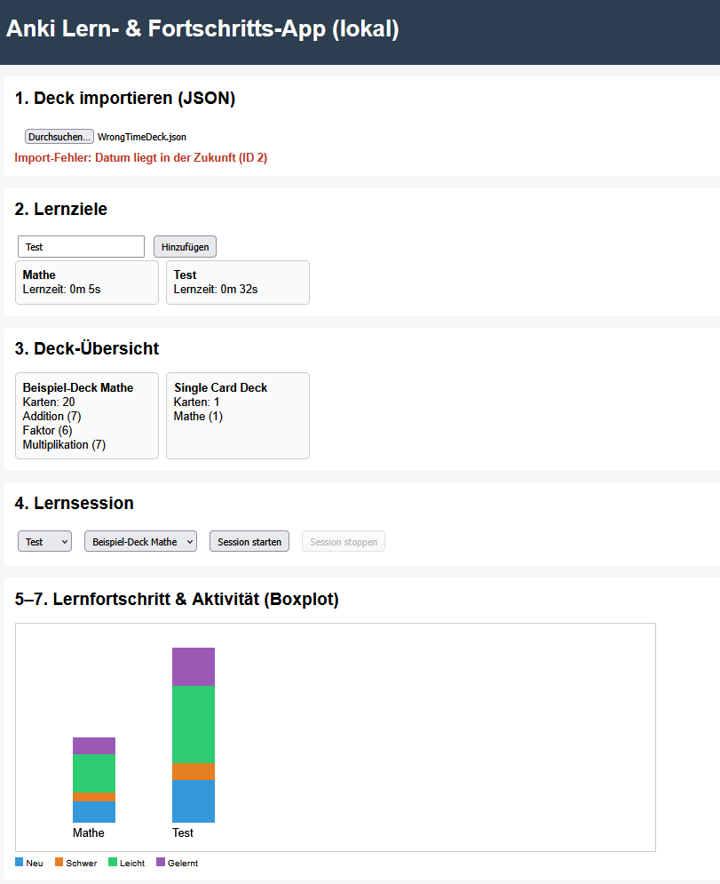
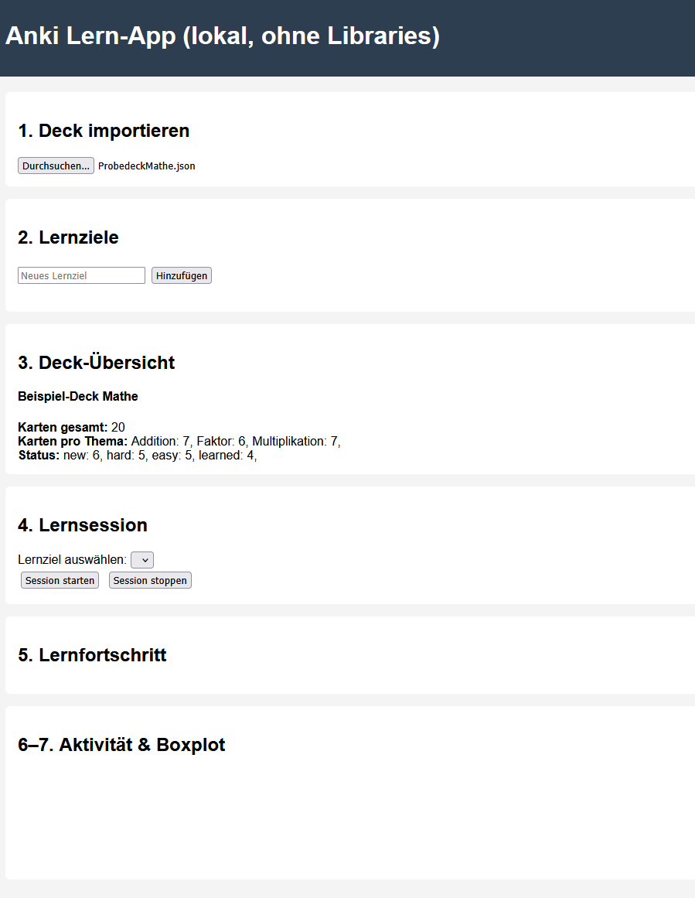

**Fragestellung und Vorgehen:**

Kann eine LLM einen Junior-Developer ersetzen und eine strickt vorgegebene Programmanforderung 
in zwei verschieden komplexen Programmiersprachen umsetzen?
Welche Probleme treten dabei auf und für welche Teile benötigt sie externe Hilfe? 
Gibt es Dinge, die gar nicht funktionieren?

Mit diesen Fragen habe ich mich im Zuge dieser Projektarbeit beschäftigt und verwende dabei
stellvertretend für kostenlose LLMs ChatGPT 5.2 und stellvertretend für Business Lösungen
Cursor AI Agents auf Basis von Claude 4.6, Gemini 3.0, GPT-5.2 / GPT-5.3 Codex und Grok Code,
wobei Cursor intern je nach Aufgabe entscheided, welches Model am besten dafür geeignet ist.
Die Verwendung dieser Modelle fand im Februar 2026 statt.

Grundlegend sollen in diesem Versuch beide Anbieter mit denselben Anforderungen eine .html erstellen, 
die lokal im Browser eine ausführbare App implementiert. Die App selbst soll mittels eines festgelegten 
Import-Formats Anki-Karten darstellen und dem Nutzer ermöglichen, seinen Fortschritt beim Lernen dieser
zu tracken und grafisch dargestellt bekommen. 
Dabei wird in zwei unterschiedlichen Versuchen die Sprache festgelegt.
Bei der leichten Version nur auf HTML, CSS und Javascript und 
bei der schweren Version auf HTML, CSS und Javascript im Frontend mit WebAssembly in Rust geschrieben im Backend. 
Damit soll ein Vergleich geschaffen werden zwischen weitverbreiteten Sprachen mit vielen Informationen
und eher unbekannteren Sprachen mit weniger Bezugsquellen dazu.
Außerdem werde ich durch gezielte Iterationen versuchen, die LLMs zum Reparieren ihrer Fehler zu bewegen.

 
**Ergebnisse:**

Im Überblick
| Versuch | Anzahl Iterationen | Zeilen Code | Ergebniss |
|:-------:|:------------------:|:-----------:|:---------:|
| Chat-GPT leicht | 6 | 442 | ✔ OK |
| Chat-GPT schwer | 4 | 261 | ✘ Abbruch |
| Cursor leicht | 3 | 1128 | ✔ OK |
| Cursor schwer | 3 | 1029 | ✔ OK |

Quality Assurance und Absicherung der Imports:

*EC = Edge-Case-Tests, maximal 6*
*Bestehend aus: DoubleID, InvalidDate(Abgelaufen), LongText, Minimal(0 Karten), MissingParts, WrongTime(Zukunft)*
| Versuch | Erfüllte EC zu Beginn | Erfüllte EC nach "Selbstreflektierung" | Erfüllte EC nach spezifischem Prompt |
|:-------:|:------------------:|:-----------:|:---------:|
| Chat-GPT leicht | 1 | 3 | 6 |
| Chat-GPT schwer | 0 | - | - |
| Cursor leicht | 1 | 3 | 6 |
| Cursor schwer | 0 | 3 | 6 |

**Chat-GPT leicht:**

Anfangs keine ordentlichen Importkontrollen und Fehler in Boxplotdarstellung.
Außerdem Implementierung für "Lernziele" nur oberflächlich und nicht eingebunden in den Rest.
Auch kritische Fehler in der Umsetzung von Lernsessions vorhanden, 
wodurch mehrere gleichzeitig startbar waren und damit das Programm zerlegt haben.
Über mehrere Iterationsschritte konnten alle Fehler dann Schritt für Schritt ausgebessert werden. 

**Chat-GPT schwer:**

Erste Version wirft bei Verwendung direkt Fehler und hat gar kein funktionierendes Backend.
Auch nach mehreren Versionen können zwar Imports oberflächlich stattfinden und Fehlermeldungen beseitigt werden, 
aber die Daten gehen direkt wieder verloren und Lernsessions können nicht gestartet werden.
Ein Boxplot ist auch nicht vorhanden. Beim aufwändigen Denkprozess zum Rust-Teil wurde zeitgleich ein Großteil 
der eigentlichen Anforderungen des Programms wieder verworfen und auch mit zusätzlichen Prompts
dreht sich die Entwicklung im Kreis. 
Deshalb habe ich den Versuch abgebrochen.

**Cursor leicht:**

Anfangs keine ordentlichen Importkontrollen, aber sehr viele Details zur besseren Verwendung aus Usersicht.
Kontrollen lassen sich leicht ergänzen und auch kleinere Alignment-Fehler sind schnell behoben.
Nur Unschönheiten in Boxplots sind nicht ganz optimal lösbar.

**Cursor schwer:**

Anfangs garkeine Importkontrollen!
Im Thinkingprozess wurde außerdem der Sinn hinter Rust-Implementierung hinterfragt.
Umsetzung aber solide, allerdings fehlen durch Mehraufwand mit Rust jetzt 
viele der "optionalen" Zusätze, die in der 1. Version noch vorhanden waren.
Kontrollen lassen sich leicht fixen und Boxplots sind diesmal von vorne herein durchdachter.

**Interpretation:**

*Bezug auf Leons Part*

**Fazit:**

Erkenntnis ChatGPT arbeitet mit Prompt als zu erreichendes Maximum (manchmal auch nur weniger)
Erkenntnis Cursor arbeitet mit Prompt als Minimum und viele Extras zusätzlich die man evtl. begrenzen muss
Antwort auf 3 ursprüngliche Fragen!!
